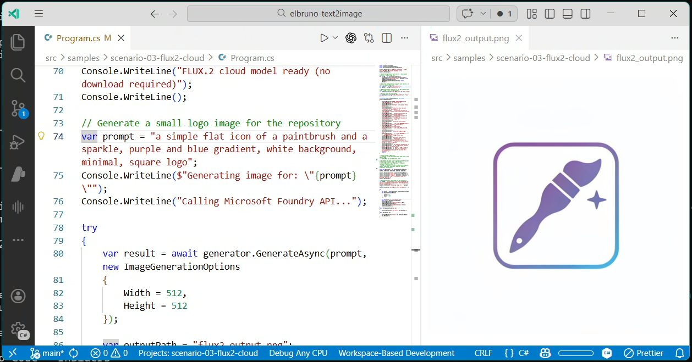

# ElBruno.Text2Image



[](https://www.nuget.org/packages/ElBruno.Text2Image)
[](https://www.nuget.org/packages/ElBruno.Text2Image.Foundry)
[](https://www.nuget.org/packages/ElBruno.Text2Image.Cpu)
[](https://www.nuget.org/packages/ElBruno.Text2Image.Cuda)
[](https://www.nuget.org/packages/ElBruno.Text2Image.DirectML)
[](https://github.com/elbruno/ElBruno.Text2Image/actions/workflows/publish.yml)
[](LICENSE)
[](https://github.com/elbruno/ElBruno.Text2Image)
[](https://twitter.com/elbruno)

**HuggingFace ONNX Models:**
[](https://huggingface.co/elbruno/stable-diffusion-2-1-ONNX)
[](https://huggingface.co/elbruno/sdxl-turbo-ONNX)

> 📢 **This project started with [FLUX.2 Flex on Microsoft Foundry](https://techcommunity.microsoft.com/blog/azure-ai-foundry-blog/meet-flux-2-flex-for-text%E2%80%91heavy-design-and-ui-prototyping-now-available-on-micro/4496041)** — a cloud-first approach to text-to-image generation with best-in-class text rendering. After wrapping that API, we thought: *"Why not bring the same developer experience to local models too?"* So we did. Now you can generate images from text prompts using cloud APIs or local Stable Diffusion models with ONNX Runtime — all through the same clean .NET interface.

A .NET library for **text-to-image generation** — cloud and local. Generate images from text prompts using Microsoft Foundry FLUX.2 or Stable Diffusion (ONNX Runtime) with automatic model downloads from HuggingFace. No Python needed. Just `dotnet add package` and go. 🚀

## 🛠️ Command-Line Tool

Install the cross-platform CLI:

```bash
dotnet tool install --global ElBruno.Text2Image.Cli
```

Update to the latest version:

```bash
dotnet tool update --global ElBruno.Text2Image.Cli
```

### CLI Examples

**Local Models (Stable Diffusion):**
```bash
t2i config                                           # interactive setup
t2i "a robot painting a landscape"                  # generate with default local model
t2i --provider stable-diffusion-15 "sunset over mountains, oil painting style"
```

**Cloud Models (Microsoft Foundry & Azure OpenAI):**
```bash
# FLUX.2 Pro (photorealistic)
t2i --provider foundry-flux2 "a futuristic cityscape with neon lights"

# FLUX.2 Flex (optimized for text-heavy design)
t2i config set foundry-flux2.model FLUX.2-flex
t2i "a business card design with modern minimalist style"

# MAI-Image-2 (high-quality generation)
t2i --provider foundry-mai2 "a serene mountain landscape at sunrise"

# GPT-Image-1.5 (DALL-E 3 via Azure OpenAI)
t2i --provider azure-openai-gpt-image-15 "an impressionist painting of a garden"

# GPT-Image-2 (next-gen model, may take 3-4 minutes)
t2i --provider gpt-image-2 "a sci-fi space station in orbit" --timeout 300
```

**Model Configuration:**
```bash
# View current configuration
t2i config show

# Set default provider for cloud generation
t2i config set provider foundry-flux2

# Set model variant
t2i config set foundry-mai2.model MAI-Image-2e
t2i config set foundry-flux2.model FLUX.2-flex

# Provide credentials
t2i config set foundry-flux2.endpoint "https://your-resource.services.ai.azure.com"
t2i config set foundry-flux2.apiKey "your-api-key"
```

See [docs/cli-tool.md](docs/cli-tool.md) for the full guide.

## Features

- 🎨 **Text-to-Image** — Generate images from text prompts using Stable Diffusion, FLUX.2, GPT-Image-1.5, and more
- 🤖 **Multiple Models** — Stable Diffusion 1.5, LCM Dreamshaper, SDXL Turbo, SD 2.1, FLUX.2, MAI-Image-2, GPT-Image-1.5, GPT-Image-2
- ☁️ **Cloud APIs** — FLUX.2, MAI-Image-2 (Microsoft Foundry), GPT-Image-1.5, GPT-Image-2 (Azure OpenAI)
- 🔧 **ONNX Runtime** — Fast, cross-platform inference (CPU, CUDA, DirectML)
- ⚡ **Auto GPU Detection** — Automatically uses GPU if available (CUDA → DirectML → CPU)
- 📦 **NuGet Package** — Simple `dotnet add package` installation
- 🎯 **Multi-target** — Supports .NET 8.0 and .NET 10.0
- 🔌 **Microsoft.Extensions.AI** — All generators implement `IImageGenerator` from [Microsoft.Extensions.AI](https://www.nuget.org/packages/Microsoft.Extensions.AI.Abstractions)
- 🌱 **Reproducible** — Seed-based generation for reproducible results

## 🤖 AI Agent Integration

The `t2i` CLI is now discoverable by GitHub Copilot and Claude Code as a native skill, enabling AI agents to generate images directly within your development workflow. Run `t2i init` to configure skill integration, which adds the necessary metadata to `.github/skills/t2i/` or `.claude/skills/t2i/` directories in your workspace. Once integrated, AI agents can autonomously invoke `t2i` for image generation tasks without manual configuration.

See [docs/skill-integration.md](docs/skill-integration.md) for the complete setup guide.

## Quick Start

### Install

Choose the package matching your hardware:

```bash
# CPU (default — works everywhere)
dotnet add package ElBruno.Text2Image.Cpu

# NVIDIA GPU (CUDA — 4x faster)
dotnet add package ElBruno.Text2Image.Cuda

# DirectML (AMD/Intel/NVIDIA on Windows)
dotnet add package ElBruno.Text2Image.DirectML

# FLUX.2 cloud via Microsoft Foundry (no GPU needed)
dotnet add package ElBruno.Text2Image.Foundry
```

> **Note:** These are mutually exclusive — install only ONE, following the same pattern as `Microsoft.ML.OnnxRuntime` vs `Microsoft.ML.OnnxRuntime.Gpu`.

### Basic Usage — Local (Stable Diffusion 1.5)

```csharp
using ElBruno.Text2Image;
using ElBruno.Text2Image.Models;

// Create a Stable Diffusion 1.5 generator (model downloads automatically on first use)
using var generator = new StableDiffusion15();

// Generate an image from a text prompt
var result = await generator.GenerateAsync("a beautiful sunset over a mountain lake, digital art");

// Save the generated image
await result.SaveAsync("output.png");
Console.WriteLine($"Generated in {result.InferenceTimeMs}ms (seed: {result.Seed})");
```

### Basic Usage — Cloud (FLUX.2 via Microsoft Foundry)

```csharp
using ElBruno.Text2Image;
using ElBruno.Text2Image.Foundry;

// Create a FLUX.2 generator using Microsoft Foundry
// Default model is FLUX.2-pro (photorealistic image generation)
using var generator = new Flux2Generator(
    endpoint: "https://your-resource.services.ai.azure.com",
    apiKey: "your-api-key",
    modelName: "FLUX.2 Pro",       // display name
    modelId: "FLUX.2-pro");        // deployment/model name

// Generate an image — same interface as local models
var result = await generator.GenerateAsync("a futuristic cityscape with neon lights, cyberpunk style");
await result.SaveAsync("flux2-output.png");

// Or use FLUX.2 Flex for text-heavy design:
using var flexGenerator = new Flux2Generator(endpoint, apiKey,
    modelName: "FLUX.2 Flex", modelId: "FLUX.2-flex");
```

### Basic Usage — Cloud (MAI-Image-2)

```csharp
using ElBruno.Text2Image;
using ElBruno.Text2Image.Foundry;

// Create an MAI-Image-2 generator using Microsoft Foundry
// Default model is MAI-Image-2
using var generator = new MaiImage2Generator(
    endpoint: "https://your-resource.services.ai.azure.com",
    apiKey: "your-api-key",
    modelName: "MAI-Image-2",
    modelId: "MAI-Image-2");

var result = await generator.GenerateAsync("a futuristic cityscape with neon lights, cyberpunk style");
await result.SaveAsync("mai-image2-output.png");

// Or use MAI-Image-2e for alternative model:
using var maiE = new MaiImage2Generator(endpoint, apiKey,
    modelName: "MAI-Image-2e", modelId: "MAI-Image-2e");
```

### Basic Usage — Cloud (GPT-Image-1.5 via Azure OpenAI)

```csharp
using ElBruno.Text2Image;
using ElBruno.Text2Image.Foundry;

// Create a GPT-Image-1.5 (DALL-E 3) generator using Azure OpenAI
using var generator = new GptImage1p5Generator(
    endpoint: "https://your-resource.openai.azure.com/",
    apiKey: "your-api-key",
    deploymentName: "gpt-image-15");

// Generate an image — same interface as other providers
var result = await generator.GenerateAsync("a serene mountain landscape at sunset, oil painting style");
await result.SaveAsync("gpt-image-1p5-output.png");

// Request specific size (1024×1024, 1792×1024, or 1024×1792)
var landscape = await generator.GenerateAsync(
    "a panoramic view of a futuristic cityscape",
    new ImageGenerationOptions { Width = 1792, Height = 1024 });
```

### With Custom Options

```csharp
using var generator = new StableDiffusion15();

var result = await generator.GenerateAsync("a futuristic cityscape at night, neon lights",
    new ImageGenerationOptions
    {
        NumInferenceSteps = 20,  // More steps = better quality
        GuidanceScale = 7.5,     // Higher = follows prompt more closely
        Width = 512,
        Height = 512,
        Seed = 42,               // For reproducible results
        ExecutionProvider = ExecutionProvider.Cpu
    });

await result.SaveAsync("cityscape.png");
```

### Microsoft.Extensions.AI Interface

All generators implement `Microsoft.Extensions.AI.IImageGenerator`, enabling a standard API:

```csharp
using Microsoft.Extensions.AI;
using ElBruno.Text2Image.Models;

// Any generator can be used via the M.E.AI interface
using var sd15 = new StableDiffusion15();
IImageGenerator generator = sd15;

var request = new ImageGenerationRequest("a whimsical treehouse in a fantasy forest");
var options = new ImageGenerationOptions
{
    ImageSize = new System.Drawing.Size(512, 512),
    AdditionalProperties = new AdditionalPropertiesDictionary
    {
        ["num_inference_steps"] = 15,
        ["guidance_scale"] = 7.5,
        ["seed"] = 42
    }
};

var response = await generator.GenerateAsync(request, options);
var imageBytes = response.Contents.OfType<DataContent>().First().Data.ToArray();
await File.WriteAllBytesAsync("output.png", imageBytes);
```

### Custom Model Directory

```csharp
// Download and use models from a specific directory
using var generator = new StableDiffusion15(new ImageGenerationOptions
{
    ModelDirectory = @"D:\MyModels",
    NumInferenceSteps = 15
});

await generator.EnsureModelAvailableAsync();
var result = await generator.GenerateAsync("a serene lake");
await result.SaveAsync("output.png");
```

### Dependency Injection

```csharp
// Local model
services.AddStableDiffusion15(options =>
{
    options.NumInferenceSteps = 20;
    options.ModelDirectory = "/path/to/models";
});

// Cloud model (requires ElBruno.Text2Image.Foundry package)
services.AddFlux2Generator(
    endpoint: "https://your-resource.openai.azure.com",
    apiKey: "your-api-key",
    modelId: "FLUX.2-pro");

// MAI-Image-2 cloud model (requires ElBruno.Text2Image.Foundry package)
services.AddMaiImage2Generator(
    endpoint: "https://your-resource.services.ai.azure.com",
    apiKey: "your-api-key",
    modelId: "MAI-Image-2");

// Inject IImageGenerator anywhere
public class MyService(IImageGenerator generator)
{
    public async Task<byte[]> GenerateImage(string prompt)
    {
        var result = await generator.GenerateAsync(prompt);
        return result.ImageBytes;
    }
}
```

## Supported Models

### Local Models (ONNX Runtime)

| Model | Class | ONNX Source | Steps | VRAM | Status |
|-------|-------|------------|-------|------|--------|
| **Stable Diffusion 1.5** | `StableDiffusion15` | `onnx-community/stable-diffusion-v1-5-ONNX` | 15-50 | ~4 GB | ✅ Available |
| **LCM Dreamshaper v7** | `LcmDreamshaperV7` | `TheyCallMeHex/LCM-Dreamshaper-V7-ONNX` | 2-4 | ~4 GB | ✅ Available |
| **SDXL Turbo** | `SdxlTurbo` | `elbruno/sdxl-turbo-ONNX` | 1-4 | ~8 GB | ✅ Available |
| **SD 2.1 Base** | `StableDiffusion21` | `elbruno/stable-diffusion-2-1-ONNX` | 15-50 | ~5 GB | ✅ Available |

### Cloud Models (REST API)

| Model | Class | Provider | Quality | Status |
|-------|-------|----------|---------|--------|
| **FLUX.2 Pro** | `Flux2Generator` | Microsoft Foundry | Excellent | ✅ Default |
| **FLUX.2 Flex** | `Flux2Generator` | Microsoft Foundry | Excellent | ✅ Available |
| **MAI-Image-2** | `MaiImage2Generator` | Microsoft Foundry | Excellent | ✅ Available |
| **GPT-Image-1.5** | `GptImage1p5Generator` | Azure OpenAI (DALL-E 3) | Excellent | ✅ Available |
See [docs/model-support.md](docs/model-support.md) for detailed model comparison.

## Samples

| Sample | Description |
|--------|-------------|
| [scenario-01-simple](src/samples/scenario-01-simple/) | Basic text-to-image generation with SD 1.5 |
| [scenario-02-custom-options](src/samples/scenario-02-custom-options/) | Custom seeds, guidance scale, and steps |
| [scenario-03-flux2-cloud](src/samples/scenario-03-flux2-cloud/) | FLUX.2 cloud API via Microsoft Foundry |
| [scenario-04-lcm-fast](src/samples/scenario-04-lcm-fast/) | Ultra-fast generation with LCM Dreamshaper (2-4 steps) |
| [scenario-05-sd21](src/samples/scenario-05-sd21/) | Stable Diffusion 2.1 at 768×768 native resolution |
| [scenario-06-model-comparison](src/samples/scenario-06-model-comparison/) | Compare SD 1.5 vs LCM side-by-side |
| [scenario-07-custom-model-directory](src/samples/scenario-07-custom-model-directory/) | Download models to a custom directory |
| [scenario-08-meai-interface](src/samples/scenario-08-meai-interface/) | Use via Microsoft.Extensions.AI `IImageGenerator` |
| [scenario-09-batch-generation](src/samples/scenario-09-batch-generation/) | Generate multiple images from a batch of prompts |
| [scenario-10-progress-reporting](src/samples/scenario-10-progress-reporting/) | Detailed download progress reporting with progress bar |
| [scenario-11-gpu-diagnostics](src/samples/scenario-11-gpu-diagnostics/) | Show CPU vs GPU provider detection and diagnostics |
| [scenario-13-mai-image2-cloud](src/samples/scenario-13-mai-image2-cloud/) | MAI-Image-2 cloud API via Microsoft Foundry |
| [scenario-15-gpt-image-1p5-cloud](src/samples/scenario-15-gpt-image-1p5-cloud/) | GPT-Image-1.5 (DALL-E 3) cloud API via Azure OpenAI |

### Run a Sample

```bash
cd src/samples/scenario-01-simple
dotnet run
```

## Documentation

- [docs/architecture.md](docs/architecture.md) — Package structure and pipeline diagrams
- [docs/gpu-acceleration.md](docs/gpu-acceleration.md) — GPU setup (CUDA, DirectML, auto-detection)
- [docs/flux2-setup-guide.md](docs/flux2-setup-guide.md) — Microsoft Foundry FLUX.2 setup
- [docs/mai-image-2-setup-guide.md](docs/mai-image-2-setup-guide.md) — Microsoft Foundry MAI-Image-2 setup
- [docs/gpt-image-1p5-setup-guide.md](docs/gpt-image-1p5-setup-guide.md) — Azure OpenAI GPT-Image-1.5 (DALL-E 3) setup
- [docs/model-support.md](docs/model-support.md) — Detailed model comparison
- [docs/onnx-conversion-guide.md](docs/onnx-conversion-guide.md) — Step-by-step ONNX conversion guide
- [docs/publishing.md](docs/publishing.md) — NuGet publishing guide (Trusted Publishing / OIDC)
- [docs/version-management.md](docs/version-management.md) — **Version bumping and unified versioning workflow**
- [docs/security.md](docs/security.md) — Security considerations and hardening
- [scripts/](scripts/) — Python conversion and upload scripts

## 👋 About the Author

Hi! I'm **ElBruno** 🧡, a passionate developer and content creator exploring AI, .NET, and modern development practices.

**Made with ❤️ by [ElBruno](https://github.com/elbruno)**

If you like this project, consider following my work across platforms:

- 📻 **Podcast**: [No Tienen Nombre](https://notienenombre.com) — Spanish-language episodes on AI, development, and tech culture
- 💻 **Blog**: [ElBruno.com](https://elbruno.com) — Deep dives on embeddings, RAG, .NET, and local AI
- 📺 **YouTube**: [youtube.com/elbruno](https://www.youtube.com/elbruno) — Demos, tutorials, and live coding
- 🔗 **LinkedIn**: [@elbruno](https://www.linkedin.com/in/elbruno/) — Professional updates and insights
- 𝕏 **Twitter**: [@elbruno](https://www.x.com/in/elbruno/) — Quick tips, releases, and tech news

## License

This project is licensed under the MIT License - see the [LICENSE](LICENSE) file for details.

## Related Projects

- [ElBruno.HuggingFace.Downloader](https://github.com/elbruno/ElBruno.HuggingFace.Downloader)
- [ElBruno.LocalEmbeddings](https://github.com/elbruno/elbruno.localembeddings)
- [ElBruno.VibeVoiceTTS](https://github.com/elbruno/ElBruno.VibeVoiceTTS)
- [ElBruno.QwenTTS](https://github.com/elbruno/ElBruno.QwenTTS)
- [ElBruno.PersonaPlex](https://github.com/elbruno/ElBruno.PersonaPlex) — NVIDIA PersonaPlex-7B-v1 speech-to-speech model wrapper for C#
