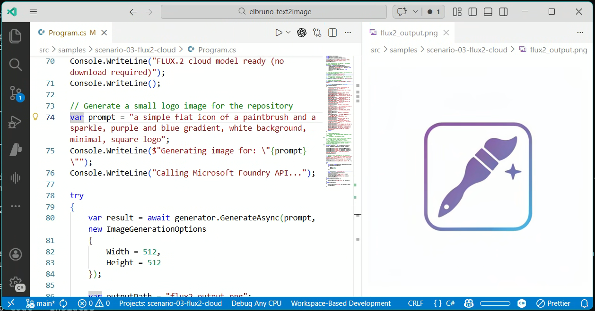

# 🎨 Text-to-Image in .NET — From FLUX.2 Pro in the Cloud to Stable Diffusion on Your Machine



⚠️ _This blog post was created with the help of AI tools. Yes, I used a bit of magic from language models to organize my thoughts and automate the boring parts, but the geeky fun and the 🎨 in C# are 100% mine._

Hi!

When Microsoft announced [FLUX.2 Flex on Microsoft Foundry](https://techcommunity.microsoft.com/blog/azure-ai-foundry-blog/meet-flux-2-flex-for-text%E2%80%91heavy-design-and-ui-prototyping-now-available-on-micro/4496041), I immediately thought: _"I need to wrap this for .NET developers."_

So I did. And then I thought: _"Wait — what if we also support local models? Same interface, no cloud needed?"_

So I did that too. 😄

The result is **ElBruno.Text2Image** — a .NET library that generates images from text prompts using either **FLUX.2 Pro via Microsoft Foundry** (cloud) or **Stable Diffusion via ONNX Runtime** (local). Same clean API surface. Your choice of backend.

Let me show you how it works.

---

## ☁️ The Cloud Side — FLUX.2 Pro on Microsoft Foundry

FLUX.2 Pro from Black Forest Labs delivers photorealistic, cinematic-quality image generation. It runs on Microsoft Foundry infrastructure — no local GPU needed, no model downloads, just an API key and go.

Here's all you need:

```csharp
using ElBruno.Text2Image;
using ElBruno.Text2Image.Foundry;

using var generator = new Flux2Generator(
    endpoint: "https://your-resource.services.ai.azure.com",
    apiKey: "your-api-key",
    modelId: "FLUX.2-pro");

var result = await generator.GenerateAsync(
    "a simple flat icon of a paintbrush and a sparkle, purple and blue gradient, white background");

await result.SaveAsync("flux2-output.png");
Console.WriteLine($"Generated in {result.InferenceTimeMs}ms");
```

That logo at the top of this post? **Generated with FLUX.2 Pro using this exact library.** The NuGet package icon too. Eating our own dog food here. 🐶

### Setting up credentials

The library reads from User Secrets, environment variables, or `appsettings.json`. For local development:

```bash
cd src/samples/scenario-03-flux2-cloud

dotnet user-secrets set FLUX2_ENDPOINT "https://your-resource.services.ai.azure.com"
dotnet user-secrets set FLUX2_API_KEY "your-api-key-here"
dotnet user-secrets set FLUX2_MODEL_NAME "FLUX.2-pro"
dotnet user-secrets set FLUX2_MODEL_ID "FLUX.2-pro"
```

> 💡 **Fun fact:** FLUX.2 models use the BFL (Black Forest Labs) Native API, not the OpenAI-compatible endpoint. The library handles this automatically — just provide your `.services.ai.azure.com` base URL and it builds the correct API path.

---

## 🖥️ The Local Side — Stable Diffusion with ONNX Runtime

Not everything needs the cloud. Sometimes you want to experiment locally, keep data private, or just tinker without API costs.

The library supports four local Stable Diffusion variants — all running via ONNX Runtime:

| Model | Package | Best for |
|---|---|---|
| Stable Diffusion 1.5 | `ElBruno.Text2Image.Cpu` | General-purpose, works everywhere |
| LCM Dreamshaper v7 | `ElBruno.Text2Image.Cpu` | Fast generation (fewer steps needed) |
| SDXL Turbo | `ElBruno.Text2Image.Cpu` | Quick drafts in 1–4 steps |
| Stable Diffusion 2.1 | `ElBruno.Text2Image.Cpu` | Higher resolution (768×768) |

Models are automatically downloaded from HuggingFace on first use. No manual setup required.

```csharp
using ElBruno.Text2Image;
using ElBruno.Text2Image.Models;

using var generator = new StableDiffusion15();

// Model downloads automatically on first run
await generator.EnsureModelAvailableAsync();

var result = await generator.GenerateAsync(
    "a simple flat icon of a paintbrush and a sparkle, purple and blue gradient, white background",
    new ImageGenerationOptions
    {
        NumInferenceSteps = 15,
        Width = 512,
        Height = 512
    });

await result.SaveAsync("local-output.png");
```

<!-- TODO: Replace with actual generated image from scenario-01 -->


### GPU acceleration

The library auto-detects your hardware and picks the best execution provider:

```bash
# CPU (default — works everywhere)
dotnet add package ElBruno.Text2Image.Cpu

# NVIDIA GPU (CUDA — significantly faster)
dotnet add package ElBruno.Text2Image.Cuda

# DirectML (AMD/Intel/NVIDIA on Windows)
dotnet add package ElBruno.Text2Image.DirectML
```

---

## 🔌 One Interface, Multiple Backends

Every generator — cloud or local — implements the same `IImageGenerator` interface **and** `Microsoft.Extensions.AI.IImageGenerator`. This means you can swap backends without changing your application logic:

```csharp
// Cloud
IImageGenerator generator = new Flux2Generator(endpoint, apiKey, modelId: "FLUX.2-pro");

// Local
IImageGenerator generator = new StableDiffusion15();

// Same API for both
var result = await generator.GenerateAsync("a futuristic cityscape at sunset");
await result.SaveAsync("output.png");
```

If you're building with Dependency Injection, the library has extension methods for that too.

---

## 📦 NuGet Packages

Five packages, pick what you need:

| Package | Description |
|---|---|
| [ElBruno.Text2Image](https://www.nuget.org/packages/ElBruno.Text2Image) | Core library (managed ONNX, no native runtime) |
| [ElBruno.Text2Image.Foundry](https://www.nuget.org/packages/ElBruno.Text2Image.Foundry) | FLUX.2 cloud via Microsoft Foundry |
| [ElBruno.Text2Image.Cpu](https://www.nuget.org/packages/ElBruno.Text2Image.Cpu) | Local models with CPU execution |
| [ElBruno.Text2Image.Cuda](https://www.nuget.org/packages/ElBruno.Text2Image.Cuda) | Local models with NVIDIA GPU (CUDA) |
| [ElBruno.Text2Image.DirectML](https://www.nuget.org/packages/ElBruno.Text2Image.DirectML) | Local models with DirectML (AMD/Intel/NVIDIA on Windows) |

All packages target **.NET 8.0** and **.NET 10.0**.

---

## 🤗 ONNX Models on HuggingFace

I exported and published the ONNX models to HuggingFace so the library can auto-download them:

- [elbruno/stable-diffusion-2-1-ONNX](https://huggingface.co/elbruno/stable-diffusion-2-1-ONNX)
- [elbruno/sdxl-turbo-ONNX](https://huggingface.co/elbruno/sdxl-turbo-ONNX)

The export process is documented in the repo if you want to convert your own models.

---

## Why I Built This

My goal has always been simple:

> Make AI easy and natural for .NET developers.

We've made great progress with [local embeddings](https://github.com/elbruno/elbruno.localembeddings), [local TTS](https://github.com/elbruno/ElBruno.VibeVoiceTTS), and agent frameworks. But when it came to **image generation**, the story was either _"use Python"_ or _"call an API and figure out the auth yourself."_

I didn't like that.

Generating images from text should be as simple as:

1. Adding a NuGet package
2. Writing a few lines of C#
3. Running your app

That's it. Whether you're calling FLUX.2 Pro in the cloud or running Stable Diffusion locally — same experience, same simplicity.

---

## 🔗 Links

- **Repository:** [github.com/elbruno/ElBruno.Text2Image](https://github.com/elbruno/ElBruno.Text2Image)
- **NuGet:** [nuget.org/packages/ElBruno.Text2Image](https://www.nuget.org/packages/ElBruno.Text2Image)
- **FLUX.2 Flex Announcement:** [Meet FLUX.2 Flex on Microsoft Foundry](https://techcommunity.microsoft.com/blog/azure-ai-foundry-blog/meet-flux-2-flex-for-text%E2%80%91heavy-design-and-ui-prototyping-now-available-on-micro/4496041)
- **Setup Guide:** [FLUX.2 Setup Guide](https://github.com/elbruno/ElBruno.Text2Image/blob/main/docs/flux2-setup-guide.md)

Happy coding! 🚀

_El Bruno_
