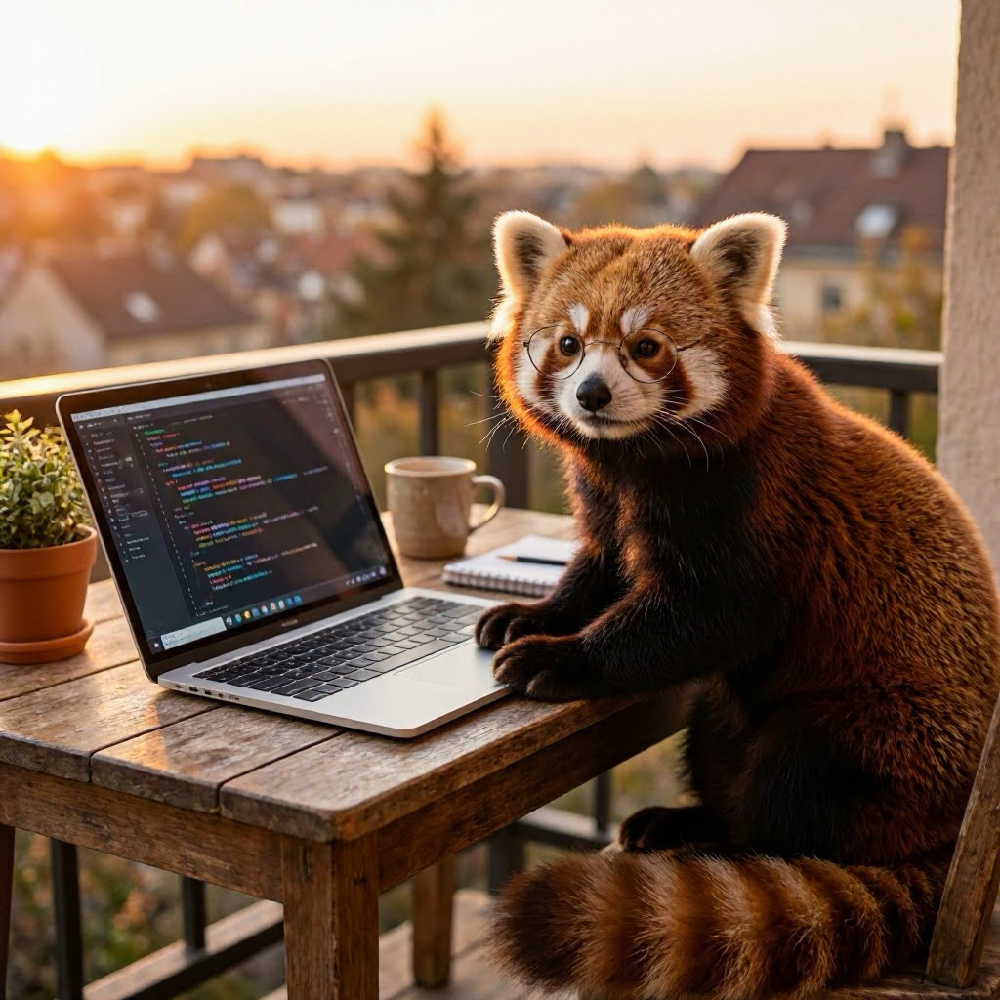

# scenario-foundry-comparison

Prompt: `A photorealistic red panda coding on a laptop, golden hour`

| Deployment | Avg latency (ms) | Tokens in | Tokens out | Cost / image (USD) | Sample |
|-----------|------------------|-----------|------------|---------------------|--------|
| MAI-Image-2e | 17068 | N/A | 1 image | 0.0340 |  |
| gpt-image-2 | 229620 | 20 | 7024 | 0.0703 |  |

> Benchmarks use 1 warm-up run and 2 measured runs per deployment.
> MAI-Image-2 currently does not return token usage in the image response, so the cost shown is the published 1024x1024 estimate and token columns stay `N/A` when usage is absent.
